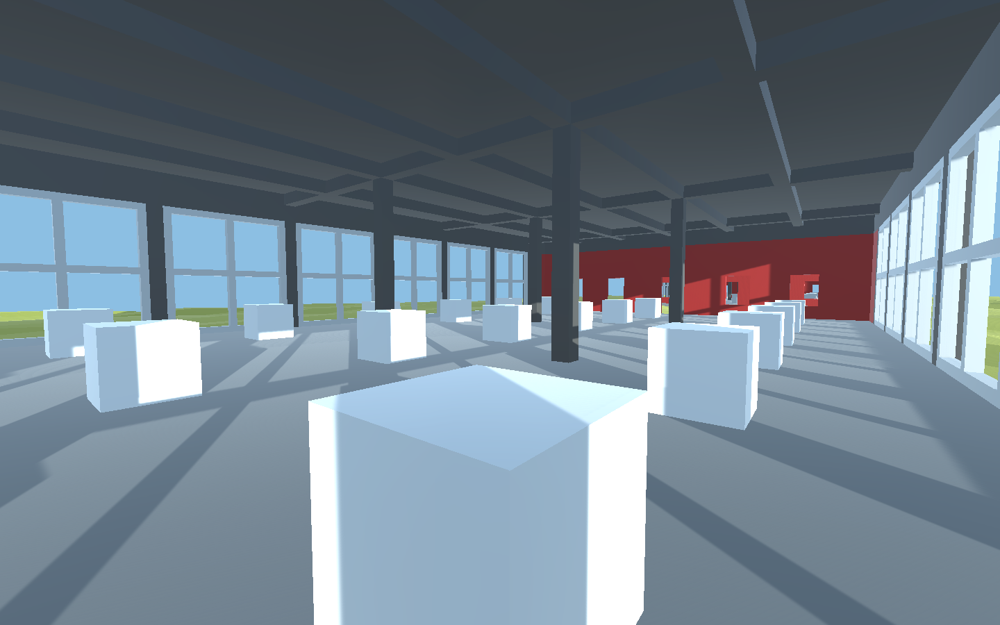

# *v r 2*

## Information
* Released: 7 June, 2016
* Website: http://www.pippinbarr.com/
* Platforms: Mac, Windows, Browser
* Link: https://www.pippinbarr.com/v-r-2/info
* Price: Free.

## Description
There's so much to see and do! But you can't see it or do it! Grapple with videogame ontology! And epistemology! Perhaps you won't see the point of any of this! I'm sorry! No I'm not!

## History
v r 2 is the unsurprisingly-named sequel to v r 1. The idea of the series is for me to explore questions around the creation of virtual 3D spaces, while also serving as a great excuse to learn Unity. If v r 1 was about the very visible configuration and reconfiguration of space, v r 2 deals more with unseen spaces and objects and ultimately with the question of "reality" in virtual worlds.

v r 2 uses the spatial template of minimalist sculptor Donald Judd's installation "100 untitled works in mill aluminum" at the Chinati Foundation in Marfa, Texas. That work involves two artillery sheds together containing a 100 boxes made of aluminum and having identical outer dimensions, but each having unique configurations of planes of the metal.

v r 2 includes a fairly literal recreation of the Judd work (scaled down to 48 total pieces), but also plays with this same idea of uniqueness in the face of similarity. In the case of v r 2, default 3D cubes serve as the sculptural element – however half of the cubes are rendered "unique" by each containing one of Unity's basic elements for the construction of games, such as 3D models, audio sources, and lights. Each of these elements is entirely hidden inside the cubes, making the cube unique, even while the player's experience of each cube is essentially the same. This idea of hidden work is in conversation with Gregor Schneider's practice of embedding rocks in walls and plastering over them or building walls in front of other walls. Schneider claims to be exploring the idea that we somehow sense these hidden objects, or that they at least affect us through their presence.

The second shed contains the other half of the cubes, each of which contains nothing at all, yet looks identical to the "unique" set. An informational placard is available at the entrance to each building to describe the contents (or lack of contents) of the cubes in it.

## Features
* A duplicate cube scaled to 75%
* A light turning on and off six times per minute
* A model of a horse
* A fountain of glowing particles
* A wind zone
* A slider that controls the brightness of the sun
* A float capsule unaffected by gravity
* An image of the wireframe model of the building
* The sound of rain
* The trunk from the game v r 1 by Pippin Barr
* A sphere surrounded by a halo
* A constant force of zero in all directions
* A landscape
* An avatar controlled by your inputs
* The input from your webcam if authorized
* A button that turns the sky black
* The default tree
* A 13-word sentence
* A reflection probe
* A cube that vanishes when you are within 2 meters
* A cylinder rotating on its z-axis once per second
* A camera that follows your movements
* A horizontal scrollbar
* A video of the trailer for this game

## Images

## Trailer
[View the trailer on YouTube](https://youtube.com/watch?v=v4JEbqq5s6o)

## Links
* [Chinati Foundation](https://www.chinati.org/index.php): The Chinati Foundation manages the Marfa, Texas site that includes the Donald Judd work "100 works in mill aluminum" referenced in this game
* [Unity](https://www.unity3d.com/index.php): Unity, in some ways the subject matter of this game, and without which it would not have been possible

## Credits
* Pippin Barr: Everything
