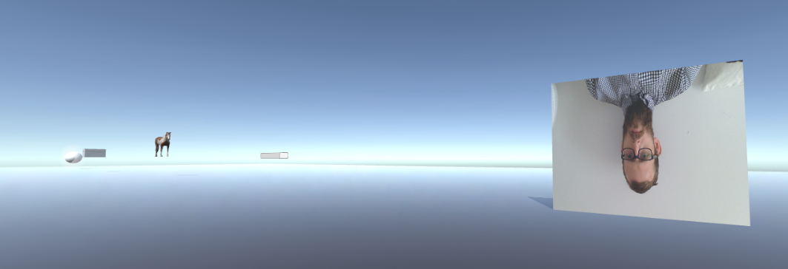
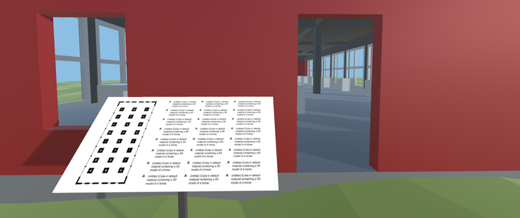
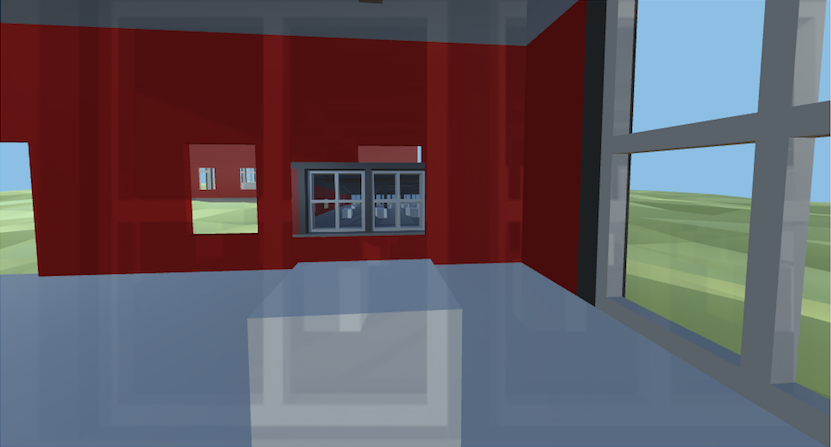
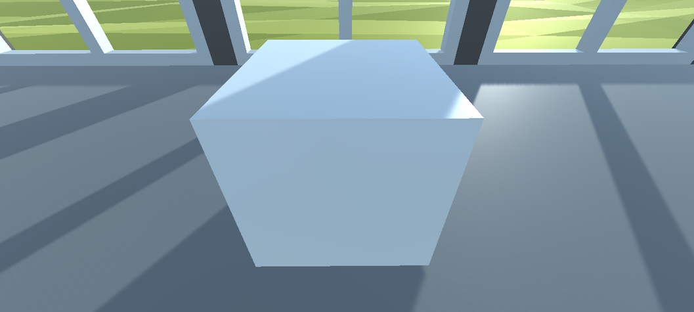
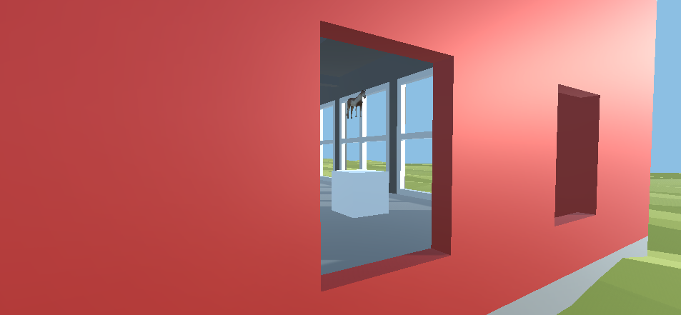

# Blog Posts

Here are public-facing blog posts I wrote while creating the game.

## New project: v r 2 (2016-05-21)

Hot on the heels of finishing off _[v r 1](http://www.pippinbarr.com/v-r-1/info)_ I've been chipping away at its "sequel" _v r 2_. Basically the series is an excuse to push myself to trying out a few different things in Unity without necessarily having to come up with a totally cohesive game idea that's at all independent of Unity itself. That is, it's easier while learning about Unity to makes games that are in some sense "about" Unity (about 3D models, architecture, first person navigation, and so on).

At the same time, I'm so far using the series as a way to engage with artworks/artists from other media. So _v r 1_ was very much about working out how to incorporate some of what [Gregor Schneider](http://www.gregor-schneider.de) does into a digital/virtual setting. _v r 2_ continues engaging with Schneider to some extent, and specifically his exploration of the effect of unseen elements of architecture (e.g. walls that are behind other walls) or elements embedded in architecture (e.g. stones embedded invisibly inside walls). In fact that's kind of the core philosophical concern of _v r 2_ – how do we feel about the "existence" of things we can't see or engage with in a virtual space?

Along with that on a more straightforwardly aesthetic level, I'm looking at Donald Judd's work _[100 works in mill aluminum](http://www.artnet.com/magazineus/features/drohojowska-philp/drohojowska-philp4-19-06_detail.asp?picnum=3)_, an installation at the weird and wonderful art compound called the [Chinati Foundation](https://www.chinati.org/collection/donaldjudd) in Marfa, Texas. That work involves exactly what the title suggests, 100 sculptures made out of aluminum. They're all kind of cubic volumes and all the same volume, but have variations in terms of the faces that compose them such that they're all uniqe. They're arranged in two beautiful old artillery sheds (48 in one and 52 in the other) and illuminated with natural light. So those are a kind of formal meditation on the multitude of forms a particular set of constraints can yield (a bit like [Oulipo](https://en.wikipedia.org/wiki/Oulipo) for metalwork).

So I'm using the idea of "unique cubes" to "hide" standard Unity assets (cubes, particle systems, textured planes, etc.) inside cubes arranged in a similar way to the Judd work. When I write all this out it sounds both incredibly simplistic and weird convoluted and involved to me. I wonder which it "actually is".

At any rate, that's what I'm up to. The screenshot leading this post is of my tests of what a nice set of "unique elements" representative of what comprises Unity projects might be. You can see a plane textured with the webcam input, a mesh of a horse, and so on. These things will be inside cubes ultimately, so enjoy seeing them while you can, bud.

## Big Excitement About Little Things (2016-05-23)

For many of the games I make – perhaps especially lately – I often worry a bit about how excited I am about kind of unexciting aspects or design decisions. This has felt particularly true with _[v r 1](http://www.pippinbarr.com/2016/05/19/v-r-1/)_ and now _v r 2_ I think, which are getting pretty deep into referencing and working with very non-game references and worlds in sort of oblique ways. So I wonder sometimes about whether I'm charging off down this particular path more or less alone. But then I read a tweet of recognition of Marfa, or my parents, who I visited Marfa with, "get it", and all is well again of course. You really only need a couple of real humans to sympathise with a project to plow ahead, after all.

And I really have taken a lot of pleasure it some of the more pedantic or "boring" elements of _v r 2_ while making it. See especially the quiet joy I've taken in designing the informative placard that is positioned at the entrances of the two buildings in the game (pictured above in a prototype state, hence all the As). I guess I can say I've spent a _lot_ of time in galleries and museums, and I've seen a bunch of these kinds of placards. There's something so pleasing about them, how certainly they point out what's what, often in the context of deeply confusing and inaccessible contemporary artworks. So you know which one is which, but perhaps nothing at all about why or how, for example. I like to think I'm carrying on that tradition in _v r 2_.

Similarly, trying to evoke a visual sense of the Judd sculptural installation _[100 works in mill aluminum](https://www.chinati.org/collection/donaldjudd)_ at Marfa, Texas in this very flat-coloured, simply-modelled environment has been lovely too. There's really something to be said for poring over reference photographs, tweaking colours, finding ways to communicate a much more complex space with a simple one. It doesn't hurt, of course, that Judd's installation (and work in general) is almost obnoxiously formalist, and translates well to the cubes and planes of Blender and Unity.

So there's a lot of very genuine joy in small, kind of boring or even "invisible" elements in this project. Whether it's realising that Unity's "Default Material" is a great substitute for "mill aluminum" or that that camera hidden inside a cube is invisible to the player, but can actually _see_ the player moving around because the reverse sides of the walls of a cube have no texture and are effectively transparent.

I do still not-so-secretly hope that this game has an audience broader than my parents and a couple of people I know who are also just _into_ this kind of stuff. I think it has a lot to say about the ontology/epistemology of our experiences in virtual spaces. But if not, so be it. I'll focus on the little things.

## Critical Debugging (2016-05-25)

_v r 2_ is now nearing completion, which has meant paying attention to whether it exports okay to WebGL which has meant finding out that no it does not do that. However the various bugs and problems involved have turned out to be an interesting way of thinking about and illustrating what the game itself is "about" to some extent. That and I like the idea of "critical debugging", sounds like something pretty neat, so let's use that as the name for what happens when bugs are bugs in ways that illustrate the critical ideas behind your game design shall we? Okay.

So, _v r 2_ is a game about the "reality" of objects/ideas inside a videogame made in Unity. The central premise is that there are elements of the game hidden inside cubes, and the idea is that as a player you get to think about this strange situation of these hidden objects "really being there" while you cannot see or access them at all. You can stand near to them, but that's it. It's not about whether or not I really put the objects in there, like some kind of practical joke – the objects are definitely in the cubes, there is really a movie playing inside a cube, there is definitely a model of a horse inside another. The point is to see what it _feels like_, in a way, to have that knowledge in a digital context.

Once again, I'm working with ideas from Gregor Schneider as a starting point here – Schneider often does work where he will embed something in a wall and refinish the wall such that you can't see it, or he'll build a wall in front of another wall, and he's interested in the idea that there's some weird kind of sensation or difference for a person who enters that space.

But on to bugs. The big bug I've been chasing for the last couple of days has to do with playing videos in WebGL. One of the cubes in _v r 2_ contains a surface which is playing the trailer for the game on a loop. However, Unity doesn't actually support having a video playing on a surface of your game in WebGL (it does for standalone builds), so I had to download and work out how to use an add-on called [Simple MovieTextures for Unity WebGL](https://www.assetstore.unity3d.com/en/#!/content/38369) to enable them. But when I actually ran it, this totally bizarre thing happened where the video would play successfully on the object I had designated as its little screen (the small rectangle in the above image showing the two windows with cubes behind them), but it would _also_ somehow play the video faintly over the top of... everything else (the kind of translucent overlay of that same image you can see above).

Putting aside the technical reasons behind this (which I don't entirely or even partially understand), the thing I like about this bug is how perfectly it works not just as a technical glitch but as a kind of "critical bug" – it clashes not just in terms of the code but in terms of the critical ideas of the game. That is, the point of the video in the game is that you _can't see it_ because it's in a cube, but it turns out that even when the video is placed inside the cube, when you approach the cube during play the video is suddenly broadcast _everywhere_ in that semi-transparent fashion. It makes the hidden thing visible and totally breaks the formal design of the game. That's pretty great, right?

So this idea of critical bugs (and critical debugging) is a nice one I think. As another example of this, consider that another one of the cubes contains a tiny version of your avatar which is also controlled by your input, moving as you move. It's meant to stay imprisoned inside the cube, obviously, so that you never see it and it just moves around in the darkness, but because of the way surfaces in Unity work, the _inside_ of a cube isn't actually solid. So what really happens that as you move around the little avatar immediately exits the cube and roams around the gallery space for you to see – again, defeating the critical intent. Things don't seem to want to stay hidden!

Anyway, next time you run into a bug (either in your own game or someone else), don't write it down to just being a ~~_[beature](http://www.pippinbarr.com/2013/04/05/beature-complete/)_~~... it might actually require some _critical debugging_!

## Now That's Commitment (2016-05-27)

So that cube that you can see there has the feed from your webcam inside it, right?

Well, no not really. I mean, it has the feed from _my_ webcam in it.

Except... not even that. It's a screenshot of the cube in the game _v r 2_ that had, at the time of the taking of the screenshot, the feed from my webcam in it. I specifically walked to the correct cube in the world of the game to take the screenshot, I didn't try to pass off just any old cube in the collection as being that one. I'm not like that.

Anyway, such is the nature of _v r 2_, it invites just these sorts of weird ontological equivocations. Which is nice.

It also involved me deciding I needed to get an SSL certificate for my website because Chrome in particular is starting to demand that you have one if you want to use the webcam in any of your pages. Partly I've been concerned about _[Let's Play: Let's Play: Ancient Greek Punishment: Art Edition Edition](//www.pippinbarr.com/2015/01/14/lets-play-lets-play-ancient-greek-punishment-art-edition-edition/)_ breaking, but mostly it was for _v r 2_ because the having the webcam in the game feels vital. It allows the player-as-human to be projected-but-invisible inside the game itself, which feels important.

So, perversely, I just had to spend a bunch of money, completely break my website (and other people's websites hosted on the same domain), and talk to customer service at my host multiple times, all for this particular little "point" about videogame/digital ontology in a specific browser. And yet, this is exactly the kind of thing that's important to me. I might be inclined to not give too much of a shit if the shaders don't look perfect in _v r 2_ (they don't), but for anything that messes with the underlying idea of the game I'm very willing to go the extra miles. That knowing of what's critical and what's only "nice" seems like a vital part of design/making to me. Most of the time it rather pleasantly allows me to ignore elements of design and aesthetics that I imagine other people caring about a great deal (see: nice-looking graphics, good sound effects, tuned game mechanics), but just occasionally it sends me down a weird rabbit-hole of caring about something very specific.

Anyway, as far as I can tell my website works again, I'm https-friendly, and can ask for the very great privilege of turning your webcam on in my games. Thanks in advance.

## Testing Reality (2016-05-29)

I now have _v r 2_ in its relatively final stages, which means mostly doing battle with WebGL (most recently working with the vagaries of the webcam), making sure it runs on different systems, adding small niceties like instructions, etc.. But one of the weirdest tests I have had to run repeatedly concerns the "reality" of the elements inside the cubes.

The basic test has been to levitate the full collection of objects two meters upward so that I can compile the game for the various systems and walk around inspecting them to make sure they're... there. Like the model of a horse above, which I am coyly showing to you here. And of course, some of the elements aren't visible anyway (sounds, for example, or odd parts of Unity like "reflection probes"), so I have to kind of take it on faith that they're there, hanging in the air with the rest of them. This has gone well – pretty much all the visible stuff has been visible barring the webcam problems and some issues with video rendering in WebGL.

But there's this other weird layer of the project which is the question of what happens when I put everything back in the cubes. Like, what's their ontological status at that point? Because of the fact I explicitly "grab" them and move them down into the cubes I know that they're "really there" in terms of what I see in Unity's editor view. I can even "see" them in the sidebar that lists everything present in the current scene, including the fact they have a specific location. If I look at these information panels while the game is running in the editor, I can even see elements of some of them changing, such as the rotation value of a particular spinning object. Though even at that point many of them are a mystery. What kind of representation does a force of zero in all directions applied to an invisible and formless game object have when it's hidden inside a cube?

And it becomes even more mysterious when I compile the game for a specific platform, like for a mac or a PC. When it compiles the game, does Unity just discard elements from the scene that can't be seen or experienced by the player? Even if it keeps them there in some form of existence, do they ever actually do anything in the cubes? Clearly Unity doesn't actually _render_ the objects in terms of visuals, because they're not visible to the player, but for example does even Unity bother to make a cylinder rotate when it cannot be seen?  I'm guessing that it would, but I'm only guessing.

And on it goes. The webcam is on, are you being rendered, frame by frame, onto a plane inside a cube? Or do you only exist when you can be seen... by yourself? Are you there?

Am I?

## Trust Issues (2016-06-11)

As you know, and indeed are still reeling from the excitement of, I released _[v r 2](https://www.pippinbarr.com/2016/06/08/v-r-2/)_ earlier in the week. As I've written about in the last couple of weeks, I think of it as a game about the "reality" of invisible virtual objects. However, a definite thread in others' interpretations of the game has been whether or not the objects I claim (on the informational placards) are in cubes are _really in the cubes_. (See, for example, [this piece by David Rudin on Kill Screen](https://killscreen.com/articles/v-r-2-tests-faith-pippin-barr/).)

This is weird for me, because I never once considered the idea of making this game without genuinely positioning all the objects (3D model of a horse, webcam feed, etc.) into the cubes for the player to (not) encounter. (And in fact if you followed some of my tweets and posts you would even have seen me running my tests to make sure I _could_ do it.) I even went so far as to have the entire second building full of _empty_ cubes partly as a way of emphasising that the first set of cubes are _not empty_...

... but of course someone trying to fool you into believing the first set of cubes have things in them _would_ do something like that. They would probably even write a blog post pleading innocence and claim there are _definitely things in the first set of cubes_.

Which leaves me in a bit of a weird and interesting quandary. There's nothing much I can do to prove the first set of objects contain things, because the point is that you can't see them. Even if I released the project source and you could check that the things are in there, perhaps I could have actually compiled the game I released such that they were. Etc. etc. Maybe if somebody decompiles the released version they'll be able to see it's all really there? I don't know.

The only problem is that the "social engineering" reading of this kind of short-circuits the thinking I actually wanted the player to engage in – I was specifically wanting players to contemplate the question of whether the objects inside the cubes remained "real" in some sense, whether they could be considered to be "really there" in a videogame if the player never sees, interacts with, or is affected by them. That's the other big reason for the empty cubes, too – there's a sense in which that building is identical to the first: it looks the same, feels the same, etc. But it _isn't the same_ because the cubes are empty.

So anyway: metaphysics and stuff.

Most importantly: you can trust me. You can _trust me_. _REALLY_.

_Trust_ me.

Please trust me.
